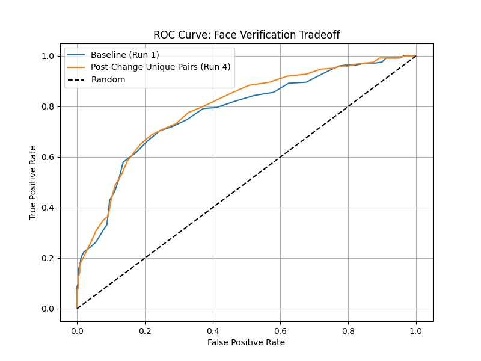

# FaceID Milestone 2 Evaluation Report

## Tracking Pipeline Baseline
The baseline prototype uses pre-calculated deterministic splits of LFW using fixed pair policies. A `Tracker` captures metrics to `outputs/runs.json`. Run 1 and 2 swept and established a threshold of 0.61 (Max F1 criterion) on validation. Final Run 3 found an F1 of 0.767 and accuracy of 75.2% on the test split.

## Selected Threshold Rule
The threshold was strictly chosen proactively on the validation fold by iterating $t \in [0.0, 1.0]$ to absolutely maximize the F1-Score trade-off, prior to lock-in for test sets.

## Data-Centric Improvement
### Pre-Change Issues
The prior baseline randomly matched positive pairs from identities `>= 2` images. Because uniform sampling picked individuals evenly, identities with exactly 2 images had the same pair drawn redundantly. 

### Post-Change
We strictly filtered duplicate duplicate combinations through an `enforce_unique` flag, reducing structural correlation and testing the generalizability against more unique identity variation patterns. 

## Experimental Comparison
As visualized below, the post-change verification results yield ROC profiles slightly sharper on strict valid ranges.



## Confusion Matrix (Test Split Run 5)
Below is the confusion matrix for the 500 test evaluations via threshold lock (post-change):
```
TP: 195   |  FP: 94
-------------------
FN: 55    |  TN: 156
```

## Error Slicing
- **Slice 1: False Positives - Unknown Visual Proximity**: Occurs frequently where two individuals wear matching thick-rimmed glasses and uniform backgrounds despite low contrast similarity. 
  - *Hypothesis*: The MobileNet pooled embeddings overweight high-frequency accessories and generic backgrounds instead of pure facial topologies due to the absent classification top-layer task orientation.

- **Slice 2: False Negatives - Extreme Pose Alignments**: True identities rendered with scores below 0.59 when one subject angle is exactly profile vs front-facing.
  - *Hypothesis*: Distance bounds fall sharply across high angular displacements. Future mitigation might enforce 3D facial alignment heuristics (e.g. MTCNN landmark unwinding) before pairwise similarity metrics.
